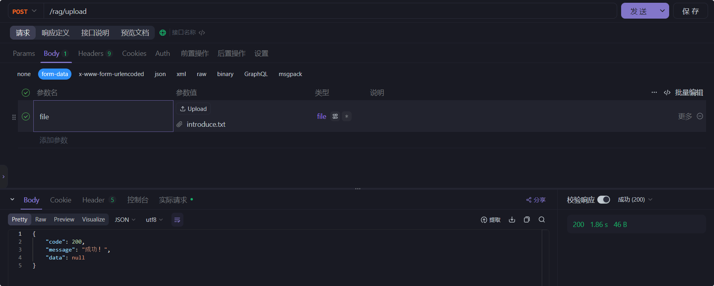

# MCP Demo

[](https://openjdk.org/)
[](https://spring.io/projects/spring-boot)
[](https://docs.spring.io/spring-ai/reference/index.html)
[](https://github.com/pgvector/pgvector)
[](https://github.com/searxng/searxng)

最近 Spring AI 发布了 1.0.0-M6，引入了一个新特性`MCP`(Model Context Protocol)，关于这个概念在这里就不过多赘述，文档介绍的比较清楚：<br>
- [MCP 中文文档](https://mcp-docs.cn/quickstart)
- [Spring AI](https://docs.spring.io/spring-ai/reference/api/mcp/mcp-overview.html)

简单来说，本地部署的 LLM 或调用三方 AI API的功能是部分缺失的(无法联网，无法访问本地附件等)，MCP 就是通过给大模型 LLM 提供各种各样的第三方工具(封装为工具类/函数)，赋予大模型 LLM 各种各样的能力(例如，访问本地文件系统的能力、访问数据库的能力、发送邮件的能力等等) <br>

跟着官方文档和网上的资料，结合着 AI (DeepSeek)，自己写了个 Demo 玩玩( Server 与 Client 写在一起的)。
## 目录

- [功能特性](#功能特性)
- [技术栈](#技术栈)
- [项目结构](#项目结构)
- [快速开始](#快速开始)
    - [环境要求](#环境要求)
    - [安装步骤](#安装步骤)

## 功能特性
大模型方面采用 DeepSeek V3 模型(使用官方 API)，通过整合自己封装的工具使其具备下面的能力：
- 获取时间<br>

- 读取本地文件系统<br>
(Spring AI Alibaba Examples 提供的样例，仓库：[https://github.com/springaialibaba/spring-ai-alibaba-examples/tree/main](https://github.com/springaialibaba/spring-ai-alibaba-examples/tree/main))

- 数据库 SQL 操作(目前只允许查询)<br>

- 发送邮件(给指定邮箱发送邮件)

- 获取系统资源详情/使用率/监控系统<br>
(QQ邮箱渲染问题，可自动忽略...)


- 整合 RAG、PgVector 向量库与本地大模型搭建知识库<br>
创建一个`introduce.txt`文件，随便放一些大模型和网上搜不到的东西

调用`/rag/upload`接口，将文件切割向量化上传至向量库<br>

查看数据库表中，已经上传成功 <br>


然后调用`/rag/inquire`接口，询问刚才上传上去的内容

证明本地大模型(用的 nomic-embed-text )能够正确读取和处理知识库中的消息
- 实时联网搜索功能<br>
使用本地化部署 SearXNG 结合 Ollama 本地化部署的大模型(当然，也可以使用其他大模型的 API)，实现本地隐私实时智能搜索<br>
实现了两种方式的搜索：
  1. 传统调取服务接口式搜索：封装了一个 `InternetSearchService` 服务类，通过封装请求先查询浏览器，将结果与问题封装为 Prompt 丢给大模型分析然后返回给用户答案(大模型被动处理结果，传统的函数式调用)，接口：**`/rag/search`**、**`/rag/stream/search`**(流式输出)<br>
  
  2. 封装一个工具类，将其注入到 MCP 中，实现大模型先查询自身数据集，无结果则主动进行联网搜索，处理并返回结果<br>
  
- ...(其他功能，可继续扩展)

## 技术栈

- **后端框架**: Spring Boot 3.x / Spring AI 1.0.0-M6
- **数据库**: MySQL 8.0 / PostgreSQL 14 / Oracle(使用多数据源策略模式，需要多少个数据源可自行添加相关数据源依赖即可)
- **API 文档**: Swagger 3
- **构建工具**: Maven
- **搜素引擎**：[SearXNG](https://docs.searxng.org/)
- **其他技术**: JDBC / JMX / Java Email / JPA

# 项目结构
```text
data/ # 数据文件
docs/ # 所需文档(命令，SQL 文件等)
src/
├── main/
│   ├── java/
│   │   └── cn/onism/mcp/
│   │       ├── common/        # 通用类
│   │       ├── config/    # 配置类
│   │       ├── constants/       # 常量类
│   │       ├── controller/    # REST API
│   │       ├── entity/    # 实体类
│   │       ├── exception/         # 自定义异常类
│   │       ├── handler/         # 处理器类
│   │       ├── repository/         # 仓储存储接口
│   │       ├── service/         # 提供服务类
│   │       ├── tool/         # (LLM)封装工具类
│   │       ├── util/         # 工具类
│   │       └── McpDemoApplication.java # 启动类
│   └── resources/
│       ├── application.yml    # 主配置文件
│       ├── static/           # 静态资源
│       └── .env/        # 环境配置文件
└── test/                      # 单元测试
```

## 快速开始

### 环境要求

- JDK 17+
- Maven 3.8+
- PostgreSQL(PgVector) 17
- MySQL  / 其他数据库
- Git
- SearXNG

### 安装步骤

1. 克隆仓库：
   ```bash
   git clone https://github.com/OnismExplorer/mcp-demo.git

2. 配置数据源
    ```yaml
   spring:
     datasources:
      datasource:
        - id: mysql
          type: mysql
          url: jdbc:mysql://localhost:5206/power_buckle?serverTimezone=GMT%2B8&useUnicode=true&characterEncoding=utf-8
          username: root
          password: 123456
          driver-class-name: com.mysql.cj.jdbc.Driver
          maxPoolSize: 15
        - id: postgres
          type: postgres
          url: jdbc:postgresql://localhost:5432/friends
          username: root
          password: 123456
          driver-class-name: org.postgresql.Driver
          max-pool-size: 10
        # 其他数据源，可继续添加，需要保证 id 全局唯一(数据源)，后续与大模型对话会用到
    ```
3. 配置邮箱(选配，用不到就不配)<br>
    修改 `resources` 中的 `.env` 环境变量文件，替换其中的 $$$ 内容
    ```dotenv
    EMAIL_ADDRESS=$$$EMAIL_ADDRESS$$$
    EMAIL_PASSWORD=$$$EMAIL_PASSWORD$$$
    ```
   如果用的不是 QQ 邮箱，则还需要修改`application.yml`文件内容(按照需要修改) 
    ```yaml
      spring:
        mail:
        # 下面这个是QQ邮箱host ， 企业邮箱 : smtp.exmail.qq.com
          host: smtp.qq.com
        # tencent mail port  这个是固定的
          port: 465
          properties:
            mail:
              smtp:
                socketFactory:
                  port: 465
                  class: javax.net.ssl.SSLSocketFactory
                ssl:
                  enable: true
    ```
4. 配置大模型 API<br>
   修改 `resources` 中的 `.env` 环境变量文件，用真实数据替换其中的 $$$ 内容
    ```dotenv
    AI_BASE_URL=$$$AI_BASE_URL$$$
    # AI 密钥，可通过 https://platform.deepseek.com/api_keys 充值获取 deepseek 官方 api key
    AI_API_KEY=$$$AI_API_KEY$$$
    # DeepSeek v3 聊天模型
    AI_MODEL=$$$AI_MODEL$$$
    ```
5. 配置本地部署大模型(可选：这里主要是)
推荐几个不错，可以本地适用 Ollama 部署的[嵌入式](https://zhuanlan.zhihu.com/p/164502624)模型：
   - **nomic-embed-text**：支持长上下文窗口(最高支持 8192 token)，适合**语义搜索**、**文档聚类**等任务，最大支持向量 768 维度
     - 适用场景：长文本语义分析、大规模知识库检索
   - **mxbai-embed-large**：混合高精度优化模型，支持多语言，在语义搜索任务中表现优异，最大支持向量 1024 维度
     - 适用场景：多语言语义匹配、企业级高精度检索
   - **bge-m3**：多语言支持(支持中文、英文等)，专门为多粒度语义任务设计，最大支持向量 1024 维度
     - 适用场景：跨语言文档检索、多粒度知识库构建
   - **snowflake-arctic-embed**：由 Snowflake 开发，优化了多语言和长文本处理，支持动态调整上下文窗口
     - 适用场景：企业级数据分析、多语言内容推荐
   - **all-minilm**：轻量级模型（参数较小，33M的大小才为 67 MB，非常迷你），适合低配置设备，支持基础语义嵌入任务
     - 适用场景：移动端应用、实时搜索

    切换模型需要修改两个地方，一个是`application.yml`文件 <br>
    ```yaml
   ollama:
      embedding:
        options:
          num-batch: 1024
          num-ctx: 8192 # 上下文长度 token 数
        model: nomic-embed-text # 换成其他想用的模型
   vectorstore:
    pgvector:
      dimensions: 768 # 需要与表中向量维度一致(根据模型修改而修改)
    ```
   另一个是`/config/RagEmbeddingConfig` 中
    ```java
   @Bean
    public PgVectorStore pgVectorStore(JdbcTemplate jdbcTemplate) {
        //....
        // 设置向量模型
                .defaultOptions(OllamaOptions.builder().model("nomic-embed-text")
        //...
        // 默认是 768
                .dimensions(768)
        //...
    }
    ```
6. 部署 `SearXNG` 搜索引擎
这里不过多赘述，没有本地部署的可以参考下面的文章自行进行部署：
   - [本地部署 SearXNG](https://onism.cn/article?id=105)
   - [本地部署 SearXNG - CSDN 博客](https://blog.csdn.net/qq_73574147/article/details/147073524?spm=1001.2014.3001.5502)

    相关 `application.yml` 配置如下
    ```yaml
    spring:
      ai:
      chat:
        client:
          type: ollama # 目前只有 ollama(默认) 、openai 两种
      websearch:
        searxng:
          url: "http://localhost:8088/search" # SearXNG 服务的 API 地址
          nums: 25
    ```
7. 构建项目
    ```bash
    mvn clean install
    ```
8. 运行应用
    ```bash
    java -jar target/mcp-demo-1.0-SNAPSHOT.jar
    ```
9. 访问应用
    ```bash
    http://localhost:8089/chat?message=hi
    ```
